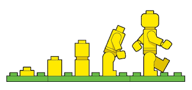

# Workshop Git en Github

E-quality

Jens Buysse <jens.buysse@gmail.com>

+++

@color[#FF0000](Heb je een vraag? Onderbreek mij!)

+++

*There is more than one way to do it*

Wat volgt zijn mijn persoonlijke aanbevelingen

+++

## `whoami`
- Jens Buysse
- *Lector ICT* Hogeschool Gent
    - Professionele bachelor toegepaste informatica
    - Android, PHP, Onderzoekstechnieken in R, stage en bachelorproef ...
- *Software ontwikkelaar* 
	- PHP, Wordpress, Yii2 ...

+++

## `sudo cp bertvv && cp github education`
De slides zijn gebaseerd op onder andere twee workshops van Bert Van Vreckem, collega aan de Hogeschool Gent.

- ttps://github.com/bertvv/git-workshop-nl](https://github.com/bertvv/git-workshop-nl)
- [https://github.com/bertvv/git-workshop-nl](https://github.com/bertvv/git-workshop-nl)

En op de officiële "Teacher training to master Git and GitHub"

- [https://education.github.com/teachers/advisors](https://education.github.com/teachers/advisors)


 +++

## Agenda

- Wat is git en wat is Github
- Basics: Git Internals
- 

+++

### Ik gebruik Git voor (bijna) alles

- [Scripts](https://github.com/bertvv/scripts), programmacode
- Handleidingen, syllabi (LaTeX FTW!)
- Presentaties [Gitpitch](https://gitpitch.com/)
- Documentatie/nota's ([Markdown](https://guides.github.com/features/mastering-markdown/))
- Verspreiden/opvolgen studentenwerk
- Samenwerken met collega's
- ...

+++

### Regelmatig repo's om zeep geholpen

+++

### Alles kan hersteld worden

(of toch zo goed als alles ...)

---

## CLI vs GUI

+++

Gebruik Git vanop de command line

+++

Tenminste, totdat je begrijpt wat je doet ...

+++

### Gebruik van GUI

- Verbergt complexiteit
- Verbergt details
- Beperkt mogelijkheden
- Bemoeilijkt troubleshooting
- **Vaak begrijp je niet wat je aan het doen bent**

+++

### CLI

- Leercurve, juiste commando's leren gaat niet vanzelf
- Geen beperkingen op mogelijkheden
- Instructies zijn éénduidig en compact
- Makkelijker reproduceerbaar

---


#Get started
1. Registreer je voor een account op github.com. 
2. Download, installeer en configureer git. (Voor Windows-gebruikers is Git voor Windows
aanbevolen). 
3. Configureer Git in je terminal om je te herkennen. Zie later.

eerst ...


### Werk met SSH sleutels

- Zorg dat Git Bash geïnstalleerd is
- Maak een SSH sleutelpaar aan (`ssh-keygen`)
- Registreer publieke sleutel (`~/.ssh/id_rsa.pub`) op Github

<https://help.github.com/articles/adding-a-new-ssh-key-to-your-github-account/>

+++

### Git basisconfiguratie

```console
$ git config --global user.name "VOORNAAM NAAM"
$ git config --global user.email "VOORNAAM.NAAM@EXAMPLE.COM"
$ git config --global push.default simple
```

of

```console
$ git config --global --edit
```

+++

### `git status` FTW!

- huidige toestand
- volgende stap
- stap terugzetten

---
#Wat is git?
@snap[west span-50]
Git is een tool dat je vooruitgang trackt in functie van de tijd
@snapend

@snap[east span-50]

@snapend

+++

### Eenvoudige workflow (solo)

Opstart:

- Repo aanmaken op Github, initialiseer met README
- Clone with SSH: `git clone git@github.com:user/repo.git`

+++

### Eenvoudige workflow (solo)

```console
[Bestanden bewerken]
$ git add .
$ git commit -m "Beschrijving aanpassingen"
$ git push
```


+++

### Gebruik na elke stap `git status`

- gewijzigde/toegevoegde bestanden: rood
- bestanden in "staging": groen
- commando voor de volgende stap
- commando om stap ongedaan te maken

+++

### Aliases

Voeg toe aan `~/.bashrc`:

```bash
alias s='git status'
alias a='git add'
alias c='git commit -m'
alias d='git diff'
alias g='git'
alias h='git log --pretty="format:%C(yellow)%h %C(blue)%ad %C(reset)%s%C(red)%d %C(green)%an%C(reset), %C(cyan)%ar" --date=short --graph --all'
alias p='git push && git push --tags'
```

+++

```bash
alias gp='git pull --rebase'
alias pr='git pull --rebase'
alias pt='git push -u origin --tags'
# Git author stats
alias gs='git ls-tree -r -z --name-only HEAD | xargs -0 -n1 git blame --line-porcelain | grep  "^author "|sort|uniq -c|sort -nr'
```

Zie: <https://github.com/bertvv/dotfiles/blob/master/.bash.d/aliases.sh>

---

## Hoe werkt Git?

- Visual Git cheat sheet: <http://ndpsoftware.com/git-cheatsheet.html#loc=stash;>
- Visualizing Git Concepts with D3: <https://onlywei.github.io/explain-git-with-d3/>

---

## Merge vs Rebase

<https://onlywei.github.io/explain-git-with-d3/>

+++

### Rebase workflow

```console
[Bestanden bewerken]
$ git add .
$ git commit -m "Beschrijving wijzigingen"
$ git pull --rebase
[Eventuele conflicten oplossen]
$ git push
```

+++

### Conflicten oplossen

```console
$ git push
To github.com:bertvv/git-demo.git
 ! [rejected]        master -> master (fetch first)
error: failed to push some refs to 'git@github.com:bertvv/git-demo.git'
hint: Updates were rejected because the remote contains work that you do
hint: not have locally. This is usually caused by another repository pushing
hint: to the same ref. You may want to first integrate the remote changes
hint: (e.g., 'git pull ...') before pushing again.
hint: See the 'Note about fast-forwards' in 'git push --help' for details.
```

+++

### Stap 1. Rebase

```console
$ git pull --rebase
```

+++

### Stap 2. Status!

```console
$ git status
rebase in progress; onto e5bd2df
You are currently rebasing branch 'master' on 'e5bd2df'.
  (fix conflicts and then run "git rebase --continue")
  (use "git rebase --skip" to skip this patch)
  (use "git rebase --abort" to check out the original branch)

Unmerged paths:
  (use "git reset HEAD <file>..." to unstage)
  (use "git add <file>..." to mark resolution)

	both modified:   README.md

no changes added to commit (use "git add" and/or "git commit -a")
```

+++

### Stap 3. Bewerk bestand(en)

- Zoek naar markeringen
- Sommige editors ondersteunen dit!

```
If you have questions, please
<<<<<<< HEAD
open an issue
=======
ask your question in IRC.
>>>>>>> branch-a
```

+++

### Stap 4. Mark resolution

```console
$ git add .
$ git status
rebase in progress; onto e5bd2df
You are currently rebasing branch 'master' on 'e5bd2df'.
  (all conflicts fixed: run "git rebase --continue")

Changes to be committed:
  (use "git reset HEAD <file>..." to unstage)

	modified:   README.md
$ git rebase --continue
```

+++

### Stap 5. Push!

```console
$ git status
$ git push
$ git status
```

---

## Samenwerken in team

+++

### Trunk based development

- Geen branches op centrale repo!
- Toegepast bij Continuous Integration/Delivery/Deployment
- Feature flags

+++

### Topic branches

- Software met discrete releases
- Master is altijd "proper"
- Complexer!
- Mogelijke bottlenecks

+++

### Pull requests

- Voor medewerkers die geen schrijftoegang hebben
- Complexer op te zetten
- Altijd committen op topic branch
- Synchroniseren met "upstream"

---

## Tips, aanbevelingen

+++

### KISS

Maak workflow niet ingewikkelder dan **strikt** noodzakelijk

+++

### Schrijf goede commit-boodschappen

- voor je teamleden
- voor je toekomstige zelf

<https://chris.beams.io/posts/git-commit/>

+++

### Atomaire commits

- Elke commit heeft precies één reden/doel
- Voeg individuele bestanden toe aan staging

+++

### Git diff

Bekijk lokale wijzigingen voordat je add/commit

+++

### Nooit publieke historiek overschrijven

Doe dit niet:

```console
$ git reset --hard
$ git push --force
```

Gebruik in plaats daarvan `git revert`

+++

### Regelmatig pushen

Hoe langer je wacht, hoe meer merge-conflicten!

+++

### Read The Fine Error/Info Message!

---

## Typische fouten rechtzetten

<https://ohshitgit.com/>

---

## Q&A

Ask me anything!

(about Git...)

---

## Bedankt!

Meer info:

* [`giteveryday`](http://git-scm.com/docs/giteveryday) (basiscommando's)
* [Visual Git Cheat Sheet](http://ndpsoftware.com/git-cheatsheet.html)
* [Visualizing Git Concepts with D3](https://onlywei.github.io/explain-git-with-d3/)
* [Git Reference](http://git-scm.com/docs) ("man pages")
* <https://github.com/bertvv>
