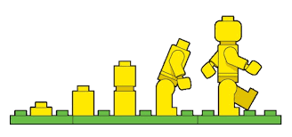

# Workshop Git en Github

E-quality

Jens Buysse <jens.buysse@gmail.com>

+++

@color[#FF0000](Heb je een vraag? Onderbreek mij!)

+++

*There is more than one way to do it*

Wat volgt zijn mijn persoonlijke aanbevelingen

+++

## `whoami`
- Jens Buysse
- *Lector ICT* Hogeschool Gent
    - Professionele bachelor toegepaste informatica
    - Android, PHP, Onderzoekstechnieken in R, stage en bachelorproef ...
- *Software ontwikkelaar* 
	- PHP, Wordpress, Yii2 ...

+++

## `sudo cp bertvv && cp github education`
De slides zijn gebaseerd op onder andere twee workshops van Bert Van Vreckem, collega aan de Hogeschool Gent.

- ttps://github.com/bertvv/git-workshop-nl](https://github.com/bertvv/git-workshop-nl)
- [https://github.com/bertvv/git-workshop-nl](https://github.com/bertvv/git-workshop-nl)

En op de officiële "Teacher training to master Git and GitHub"

- [https://education.github.com/teachers/advisors](https://education.github.com/teachers/advisors)


 +++

## Agenda

- Wat is git en wat is Github
- Basics: Git Internals
- 

+++

### Ik gebruik Git voor (bijna) alles

- [Scripts](https://github.com/bertvv/scripts), programmacode
- Handleidingen, syllabi (LaTeX FTW!)
- Presentaties [Gitpitch](https://gitpitch.com/)
- Documentatie/nota's ([Markdown](https://guides.github.com/features/mastering-markdown/))
- Verspreiden/opvolgen studentenwerk
- Samenwerken met collega's
- ...

+++

### Regelmatig repo's om zeep geholpen

+++

### Alles kan hersteld worden

(of toch zo goed als alles ...)

---

## CLI vs GUI

+++

Gebruik Git vanop de command line

+++

Tenminste, totdat je begrijpt wat je doet ...

+++

### Gebruik van GUI

- Verbergt complexiteit
- Verbergt details
- Beperkt mogelijkheden
- Bemoeilijkt troubleshooting
- **Vaak begrijp je niet wat je aan het doen bent**

+++

### CLI

- Leercurve, juiste commando's leren gaat niet vanzelf
- Geen beperkingen op mogelijkheden
- Instructies zijn éénduidig en compact
- Makkelijker reproduceerbaar

---


#Get started
1. Registreer je voor een account op github.com. 
2. Download, installeer en configureer git. (Voor Windows-gebruikers is Git voor Windows
aanbevolen). 
3. Configureer Git in je terminal om je te herkennen. Zie later.

eerst ...

+++ 

### Werk met SSH sleutels

- Zorg dat Git Bash geïnstalleerd is
- Maak een SSH sleutelpaar aan (`ssh-keygen`)
- Registreer publieke sleutel (`~/.ssh/id_rsa.pub`) op Github

<https://help.github.com/articles/adding-a-new-ssh-key-to-your-github-account/>

+++

### Git basisconfiguratie

```console
$ git config --global user.name "VOORNAAM NAAM"
$ git config --global user.email "VOORNAAM.NAAM@EXAMPLE.COM"
$ git config --global push.default simple
```

of

```console
$ git config --global --edit
```

+++

### `git status` FTW!

- huidige toestand
- volgende stap
- stap terugzetten

---
# Wat is git - basics?
+++

@snap[west span-50]
*Git* is een tool dat je vooruitgang trackt in functie van de tijd
@snapend

@snap[east span-50]

@snapend

+++

### Git neemt snapshots
+++

@snap[west span-50]

* Je kan snapshots maken om zo op je stappen terug te keren
* Je kan deze snapshots ook delen met anderen

@snapend

@snap[east span-50]

@snapend

+++
### Een repository beheert the geschiedenis van je project

* Elk project moet zijn eigen repository hebben
	* *Dus Bv. geen Angular en Android project op dezelfde repo*

+++
### Een repo aanmaken
```console
$ cd dirNaam
$ git init oefening
$ cd oefening
$ ls -al
```
of
Opstart:

- Repo aanmaken op Github, initialiseer met README
- Clone with SSH: 

```console
$ git clone git@github.com:user/repo.git
```


+++

### `git` is jouw bureau

1. **Working directory**: waar je werkt en schrijft
2. ***Staging area***: een kladversie klaar om te reviewen
3. ***Repository***: finale versie, klaar om te archiveren

+++


### Eenvoudige workflow (solo)
#### File aanmaken en toevoegen aan staging

```console
$ touch readme.md
$ git status
$ git add reamdme.md
```
@snap[midpoint, south]

@snapend


+++

### Eenvoudige workflow (solo)
#### Commit maken
```console
$ git commit -m "Beschrijving aanpassing"
```
@snap[midpoint, south]

@snapend


+++
### Hoe schrijf je een `git commit` Message


+++
### Hoe schrijf je een `git commit` Message

1. Scheid subject van body met een lege regel
2. Beperk de onderwerpregel tot 50 tekens
3. Begin met een hoofdletter voor het onderwerp
4. Beëindig de onderwerpregel niet met een punt
5. Gebruik de gebiedende wijs in de onderwerpregel
6. Max body tekens: 72
7. Gebruik body om uit te leggen wat en waarom en hoe (indien nodig)

+++

Commit-berichten met een body zijn niet zo eenvoudig om te schrijven met de -m optie. U kunt beter het bericht schrijven in ee teksteditor. 

[https://git-scm.com/book/en/v2/Customizing-Git-Git-Configuration](Git configuratie aanpassen.)

+++


### Gebruik na elke stap `git status`

- gewijzigde/toegevoegde bestanden: rood
- bestanden in "staging": groen
- commando voor de volgende stap
- commando om stap ongedaan te maken

+++

### Gebruik na elke stap `git status`
#### `git diff`

- Vergelijkt staging met de working directory
- Geen output indien deze dezelfde zijn

+++

### Gebruik na elke stap `git status`
#### `git diff --staged`

- Vergelijkt staging met de repository directory
- Geen output indien deze dezelfde zijn

+++

### Commits moeten logisch geordend zijn

- ***Per feature 1 commit!***
- Wat als je een rollback doet waar twee features inzitten, maar je moet er maar 1 van veranderen
	- Tweede feature wordt dan ook gerollbackt.

+++
### Commits moeten logisch geordend zijn
Soms is de staging area soms iets ingewikkelder dan je in je workflow nodig hebt. Als je de staging area wilt overslaan, dan kan je met Git makkelijk de route inkorten.

```console
$ git add -a
```

+++

## Ctrl-Z!

* Je kan (zo goed als) elke stap ongedaan maken!
* Lokale wijzigingen aan `README.md` ongedaan maken:

    ```bash
    git checkout -- README.md
    ```

* `README.md` opnieuw uit `staging` halen :

    ```bash
    git reset HEAD README.md
    ```

* `git status` herinnert telkens aan deze commando's!

+++

## Historiek
```none
$ git log
commit 97deea303754171c717291387af87e9b891f28fb
Author: Bert Van Vreckem <bert.vanvreckem@gmail.com>
Date:   Sat Nov 15 16:50:20 2014 +0100

    Added .gitignore

commit aadfd674f5dec9205fde484a5d921041b256b135
Author: Bert Van Vreckem <bert.vanvreckem@gmail.com>
Date:   Sat Nov 15 14:47:46 2014 +0100

    README toegevoegd
```

+++


### Pro tip: Aliases

Voeg toe aan `~/.bashrc`:

```bash
alias s='git status'
alias a='git add'
alias c='git commit -m'
alias d='git diff'
alias g='git'
alias h='git log --pretty="format:%C(yellow)%h %C(blue)%ad %C(reset)%s%C(red)%d %C(green)%an%C(reset), %C(cyan)%ar" --date=short --graph --all'
alias p='git push && git push --tags'
```

+++

```bash
alias gp='git pull --rebase'
alias pr='git pull --rebase'
alias pt='git push -u origin --tags'
# Git author stats
alias gs='git ls-tree -r -z --name-only HEAD | xargs -0 -n1 git blame --line-porcelain | grep  "^author "|sort|uniq -c|sort -nr'
```

Zie: <https://github.com/bertvv/dotfiles/blob/master/.bash.d/aliases.sh>

+++
### Oefening: Maak je eigen repo

- Maak je repo aan
- Configureer zoals nodig
- Pas de readme.md file aan
- Commit de aanpassingen

___
## Hoe werkt Git?

- Visual Git cheat sheet: <http://ndpsoftware.com/git-cheatsheet.html#loc=stash;>
- Visualizing Git Concepts with D3: <https://onlywei.github.io/explain-git-with-d3/>

---

# Werken met Github

+++

## Workflow

@snap[midpoint, south]

@snapend


+++

## Github

[https://github.com/](https://github.com/)

* Bekendste hosting-provider voor Git repositories
* Gratis voor open source

+++

## Github account

* Maak een Github-account aan
    * koppel aan emailadres 

+++

## Repository aanmaken

Maak op Github een nieuwe repository aan (bv. `my_project`)

* Evt. "Initialize this repository with a README"
* Website wordt: `https://github.com/USER/PROJECT`
* Repo url (https) wordt: `https://github.com/USER/PROJECT.git`
* Repo url (**ssh**) wordt: `git@github.com:USER/PROJECT.git`

+++


+++

## Lokale kopie maken

1. Klik groene knop "Clone or download", kopieer url
2. Open commando-prompt (Git Bash)
3. `git clone https://github.com/bertvv/my_project.git`

+++

## Lokale kopie maken

```console
$ git clone https://github.com/bertvv/my_project.git
Cloning into 'my_project'...
remote: Counting objects: 9, done.
remote: Compressing objects: 100% (6/6), done.
Receiving objects: 100% (9/9), done.
remote: Total 9 (delta 0), reused 9 (delta 0)
Checking connectivity... done.
```

+++

## Github workflow voor één persoon

```bash
$ git pull
[bewerk bestanden]
$ git status
$ git add file1 file2
$ git commit -m "Beschrijving van de wijzigingen"
$ git push
```

- `pull`: Wijzigingen Github -> lokaal
- `push`: Wijzigingen lokaal -> Github

---

+++

## Het kan ook anders

Om een ​​nieuwe remote toe te voegen, gebruikt u de opdracht `git remote add` op de terminal in de directory waarin uw repository is opgeslagen.

Het commando git remote add neemt twee argumenten:

1. Een externe naam, bijvoorbeeld oorsprong
2. Een externe URL, bijvoorbeeld https://github.com/user/repo.git

+++

## Het kan ook anders
```console
# Set a new remote
$ git remote add origin https://github.com/user/repo.git
# Verify new remote
$ git remote -v
origin  https://github.com/user/repo.git (fetch)
origin  https://github.com/user/repo.git (push)
```

+++
### Oefening

1. Genereer een repository - mag ook dezelfde zijn als in voorgaande oefening
2. Maak een repository op Github
3. Push het werk dat je gemaakt hebt naar de remote

___

# Werken in team

+++

## Anderen toegang geven tot je repository

* Klik rechts op **Settings**
* In het menu links, klik op **Collaborators**
* Voeg de gebruikersnamen toe van wie toegang moet krijgen

+++

## Een project opzetten in GitHub

* Eén persoon doet:
    * Aanmaken nieuwe repository
    * Optie voor creëren README + `.gitignore` aanvinken
    * Teamleden toevoegen
* Iedereen doet
    * `git clone https://github.com/USER/PROJECT.git`

+++

## Workflow: werken in een team

* Haal laatste revisie binnen: `git pull origin master`
* Maak wijzigingen: `git add`, `git commit`
* Nogmaals: `git pull --rebase`
* Naar centrale repository: `git push origin master`

- `-u` is kort voor `--set-upstream`
- 

---


## Merge vs Rebase

<https://onlywei.github.io/explain-git-with-d3/>

+++

### Rebase workflow

```console
[Bestanden bewerken]
$ git add .
$ git commit -m "Beschrijving wijzigingen"
$ git pull --rebase
[Eventuele conflicten oplossen]
$ git push
```

+++

### Conflicten oplossen

```console
$ git push
To github.com:bertvv/git-demo.git
 ! [rejected]        master -> master (fetch first)
error: failed to push some refs to 'git@github.com:bertvv/git-demo.git'
hint: Updates were rejected because the remote contains work that you do
hint: not have locally. This is usually caused by another repository pushing
hint: to the same ref. You may want to first integrate the remote changes
hint: (e.g., 'git pull ...') before pushing again.
hint: See the 'Note about fast-forwards' in 'git push --help' for details.
```

+++

### Stap 1. Rebase

```console
$ git pull --rebase
```

+++

### Stap 2. Status!

```console
$ git status
rebase in progress; onto e5bd2df
You are currently rebasing branch 'master' on 'e5bd2df'.
  (fix conflicts and then run "git rebase --continue")
  (use "git rebase --skip" to skip this patch)
  (use "git rebase --abort" to check out the original branch)

Unmerged paths:
  (use "git reset HEAD <file>..." to unstage)
  (use "git add <file>..." to mark resolution)

	both modified:   README.md

no changes added to commit (use "git add" and/or "git commit -a")
```

+++

### Stap 3. Bewerk bestand(en)

- Zoek naar markeringen
- Sommige editors ondersteunen dit!

```
If you have questions, please
<<<<<<< HEAD
open an issue
=======
ask your question in IRC.
>>>>>>> branch-a
```

+++

### Stap 4. Mark resolution

```console
$ git add .
$ git status
rebase in progress; onto e5bd2df
You are currently rebasing branch 'master' on 'e5bd2df'.
  (all conflicts fixed: run "git rebase --continue")

Changes to be committed:
  (use "git reset HEAD <file>..." to unstage)

	modified:   README.md
$ git rebase --continue
```

+++

### Stap 5. Push!

```console
$ git status
$ git push
$ git status
```

---

## Samenwerken in team

+++

### Trunk based development

- Geen branches op centrale repo!
- Toegepast bij Continuous Integration/Delivery/Deployment
- Feature flags

+++

### Topic branches

- Software met discrete releases
- Master is altijd "proper"
- Complexer!
- Mogelijke bottlenecks

+++

### Pull requests

- Voor medewerkers die geen schrijftoegang hebben
- Complexer op te zetten
- Altijd committen op topic branch
- Synchroniseren met "upstream"

---

## Tips, aanbevelingen

+++

### KISS

Maak workflow niet ingewikkelder dan **strikt** noodzakelijk

+++

### Schrijf goede commit-boodschappen

- voor je teamleden
- voor je toekomstige zelf

<https://chris.beams.io/posts/git-commit/>

+++

### Atomaire commits

- Elke commit heeft precies één reden/doel
- Voeg individuele bestanden toe aan staging

+++

### Git diff

Bekijk lokale wijzigingen voordat je add/commit

+++

### Nooit publieke historiek overschrijven

Doe dit niet:

```console
$ git reset --hard
$ git push --force
```

Gebruik in plaats daarvan `git revert`

+++

### Regelmatig pushen

Hoe langer je wacht, hoe meer merge-conflicten!

+++

### Read The Fine Error/Info Message!

---

## Typische fouten rechtzetten

<https://ohshitgit.com/>

---

## Q&A

Ask me anything!

(about Git...)

---

## Bedankt!

Meer info:

* [`giteveryday`](http://git-scm.com/docs/giteveryday) (basiscommando's)
* [Visual Git Cheat Sheet](http://ndpsoftware.com/git-cheatsheet.html)
* [Visualizing Git Concepts with D3](https://onlywei.github.io/explain-git-with-d3/)
* [Git Reference](http://git-scm.com/docs) ("man pages")
* <https://github.com/bertvv>
